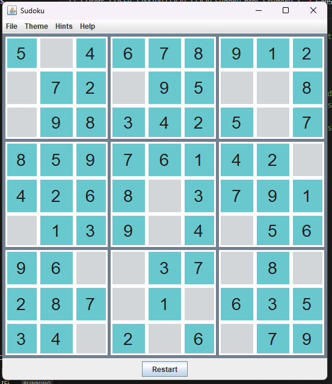
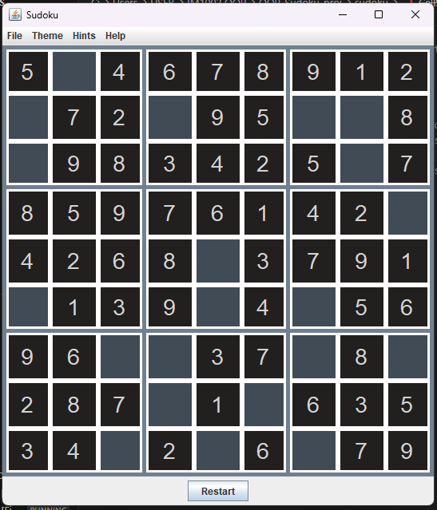

# 🧩 Sudoku Game
> A Java-based Sudoku game with multiple difficulty levels, dark/light mode, and sound effects.

## ✨ Features
- **4 Difficulty Levels**: 
  - Normal (60 clues)
  - Advanced (45)
  - Expert (35) 
  - Hell (25)
- **Smart Validation**: Real-time conflict detection
- **UI Themes**: Toggle between light/dark mode
- **Audio Feedback**: Sound effects for moves
- **Hint System**: Reveal one cell or solve entire puzzle

## 🚀 How to Run
```bash
# Clone the repository
git clone https://github.com/kohkehui/sudoku-game.git

# Compile and run
cd sudoku-game/src
javac sudoku/*.java
java sudoku.SudokuMain
```

## 🛠️ Project Structure
src/
└── sudoku/
├── Cell.java # Custom cell UI/UX
├── GameBoardPanel.java # Main game logic
├── Puzzle.java # Puzzle generator
├── SoundEffects.java # Audio manager
└── ...
sounds/
├── correct.wav
├── won.wav
└── wrong.wav

## 📸 Screenshots
## Screenshots

| Light Mode | Dark Mode |
|------------|-----------|
|  |  |

## Contributors
- [Ke Hui](https://github.com/kohkehui)
- [Nasuhah](https://github.com/nasuhah)

## License
MIT © 2023 [Ke Hui]